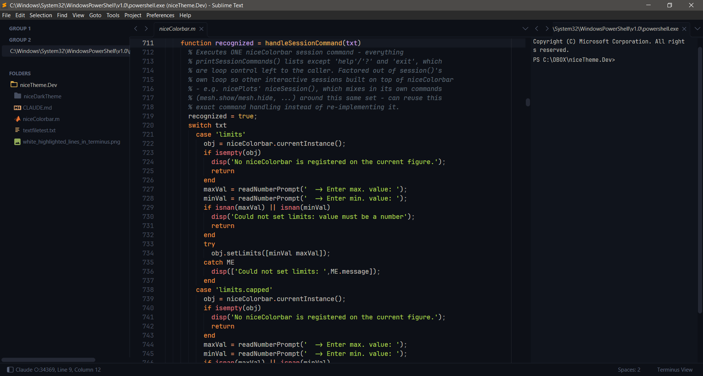
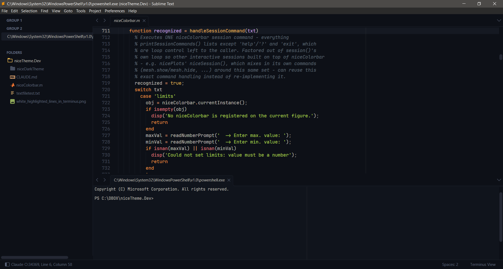
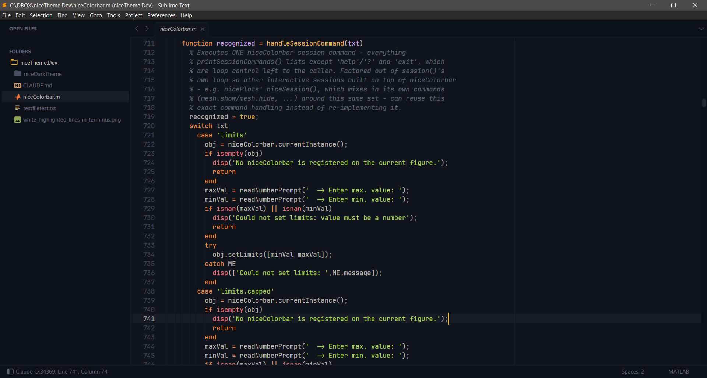

# niceDarkTheme

A dark UI theme and color scheme for Sublime Text 4, with a three-pane default layout:

```
┌──────────┬──────────────────────────────┬──────────────┐
│ side bar │ files (70%)                  │ terminal     │
│ folders  │                              │ (Terminus,   │
│ & open   │                              │  30%)        │
│ files    │                              │              │
└──────────┴──────────────────────────────┴──────────────┘
```



The menu stays a horizontal bar at the top of the window on Windows and Linux. It is not collapsed into a hamburger button.

### Alternative layouts

You can change the layout at any time, either from the menu under **Preferences › Package Settings › niceDarkTheme**, or from the Command Palette (<kbd>Ctrl/Cmd</kbd>+<kbd>Shift</kbd>+<kbd>P</kbd>) by typing `niceDarkTheme` and choosing **Terminal on the Right**, **Terminal at the Bottom** or **Without Terminal**.

**Terminal at the bottom.** The terminal sits under the files, as wide as the editor area. The side bar is unaffected. Switch with **Terminal at the Bottom** (and back with **Terminal on the Right**).

```
┌──────────┬─────────────────────────────────────────────┐
│ side bar │ files (65%)                                 │
│          ├─────────────────────────────────────────────┤
│          │ terminal (Terminus, 35%)                    │
└──────────┴─────────────────────────────────────────────┘
```



**No terminal.** Just the side bar and your files in a single view. Switch with **Without Terminal**. If a terminal is open, it asks before closing it, because that ends whatever is running in it. New windows then open without a terminal until you pick **Terminal on the Right** or **at the Bottom** again.

```
┌──────────┬────────────────────────────────────────────┐
│ side bar │ files                                      │
│          │                                            │
│          │                                            │
└──────────┴────────────────────────────────────────────┘
```



## Install

### What you need

| What | Needed for | Without it | How to get it |
|---|---|---|---|
| [Sublime Text 4](https://www.sublimetext.com) | the theme itself | | developed and tested on build 4200 (Sublime Text 3 is untested) |
| [A File Icon](https://packagecontrol.io/packages/A%20File%20Icon) | file-specific icons in the side bar | folder icons only, files get a generic icon | niceDarkTheme offers it on first install, or run **niceDarkTheme: Install File Icons (A File Icon)** |
| [Terminus](https://packagecontrol.io/packages/Terminus) | the terminal pane (right or bottom) | windows open with the side bar and files only | **niceDarkTheme: Activate** offers it, or **Package Control: Install Package › Terminus** |
| [JetBrains Mono](https://www.jetbrains.com/lp/mono/) font | only **Apply Recommended Settings**, which sets it as the editor font | Sublime falls back to its default font | install the font on your system; it isn't bundled |

A File Icon and Terminus are separate packages, and Package Control can't install them as dependencies of a theme. That is why they are offered as prompts. Restart Sublime Text after installing A File Icon.

### Package Control

1. Open the Command Palette (<kbd>Ctrl/Cmd</kbd>+<kbd>Shift</kbd>+<kbd>P</kbd>) and run **Package Control: Install Package**.
2. Choose **niceDarkTheme**.
3. When asked, install **A File Icon** (see [File icons](#file-icons)), then restart Sublime Text.
4. Run **niceDarkTheme: Activate** from the Command Palette. If Terminus is missing, it offers to install it.
5. Optional: run **niceDarkTheme: Apply Recommended Settings** (see [Commands](#commands)).

### Manual

Clone this repository into your `Packages` folder (**Preferences › Browse Packages…**) as `niceDarkTheme`:

```sh
git clone https://github.com/aaortizb/niceDarkTheme.git niceDarkTheme
```

Or activate it by hand in `Preferences.sublime-settings`:

```jsonc
"theme": "niceDarkTheme.sublime-theme",
"color_scheme": "niceDarkTheme.sublime-color-scheme",
```

### File icons

The folder icons come with the theme. The file-specific icons (MATLAB, Markdown, images, ...) are drawn by the [A File Icon](https://packagecontrol.io/packages/A%20File%20Icon) package, which uses the icon set that ships with niceDarkTheme. Package Control can't install another package automatically, so niceDarkTheme asks you on first install. If you said no, or installed the theme by hand, run **niceDarkTheme: Install File Icons (A File Icon)** from the Command Palette, or **Package Control: Install Package › A File Icon**, and restart Sublime Text. Without A File Icon, files show a generic icon.

## Layout

When niceDarkTheme is the active theme, every window gets the layout at startup and whenever a new window opens. A window that already has a terminal, such as one restored from the last session, is left alone.

Switch the terminal's position under **Preferences › Package Settings › niceDarkTheme**: **Terminal on the Right**, **Terminal at the Bottom** or **Without Terminal**. The same three are in the Command Palette as **niceDarkTheme: Terminal on the Right** and so on. The choice is remembered, and an open terminal moves with it. Changing `terminal_column_width` or `terminal_row_height` in the settings, or `terminal_position` to `"right"` or `"bottom"`, applies to open windows as soon as you save. `"none"` takes effect in new windows; use **Without Terminal** to close the terminal in a window you already have.

The terminal needs [Terminus](https://packagecontrol.io/packages/Terminus). Without Terminus, windows open with the side bar and files only.

Change these options under **Preferences › Package Settings › niceDarkTheme › Settings**:

| Setting | Default | Description |
|---|---|---|
| `layout_on_startup` | `true` | Apply the layout at startup and in new windows |
| `terminal_position` | `"right"` | `"right"` (column), `"bottom"` (row) or `"none"` (no terminal) |
| `terminal_column_width` | `0.3` | Width fraction of the terminal on the right |
| `terminal_row_height` | `0.35` | Height fraction of the terminal at the bottom |
| `open_terminal` | `true` | Open a Terminus terminal. `false` also gives the single view |
| `terminal_args` | `{}` | Arguments for `terminus_open`, e.g. `{"config_name": "PowerShell"}` |
| `keep_files_out_of_terminal` | `true` | Files opened while the terminal has focus open in the files pane, not next to the terminal |
| `focus_files_after_terminal` | `true` | Return focus to the files column |
| `show_side_bar` / `show_minimap` | `true` / `false` | Side bar and minimap visibility |

## Commands

| Command Palette | Command |
|---|---|
| niceDarkTheme: Activate | `nice_activate` |
| niceDarkTheme: Apply Recommended Settings | `nice_apply_recommended_settings` |
| niceDarkTheme: Install File Icons (A File Icon) | `nice_install_file_icons` |
| niceDarkTheme: Apply Default Layout | `nice_apply_layout` |
| niceDarkTheme: Open Terminal | `nice_open_terminal` |
| niceDarkTheme: Terminal on the Right | `nice_set_terminal_position` `{"position": "right"}` |
| niceDarkTheme: Terminal at the Bottom | `nice_set_terminal_position` `{"position": "bottom"}` |
| niceDarkTheme: Without Terminal | `nice_set_terminal_position` `{"position": "none"}` |

niceDarkTheme indents with 2 spaces by default (`"tab_size": 2`, `"translate_tabs_to_spaces": true`). This default applies while the package is installed, even if you switch to another theme. Your own Preferences and syntax-specific settings override it.

**Apply Recommended Settings** asks for confirmation, then writes these editor settings to your user preferences: JetBrains Mono at 10.5, phase caret, a highlighted current line, line padding of 1, a ruler and word wrap at column 90, 2-space soft tabs, trimming trailing whitespace on save, and saving on focus lost. If Terminus is installed, it also sets the Terminus font size to 9 and the history to 3,000 lines. On Windows, it makes PowerShell the default Terminus shell, because under cmd.exe full-screen programs such as Claude Code can lag and misdraw typed characters. The dialog lists every change before anything is written.

## Theme options

Set these in `Preferences.sublime-settings`:

| Setting | Default | Description |
|---|---|---|
| `nice_separator` | `true` | Separators between the side bar, editor and panels |
| `nice_wide_scrollbars` | `false` | Wider scroll bars |
| `nice_custom_titlebar` | `false` | Theme-colored title bar. On Windows, this collapses the menu into a hamburger button |

File icons can be customized with [A File Icon](https://packagecontrol.io/packages/A%20File%20Icon).

## Credits

niceDarkTheme is based on the dark variant of [ayu](https://github.com/dempfi/ayu) by Ike Ku (MIT). See [LICENSE](LICENSE).
